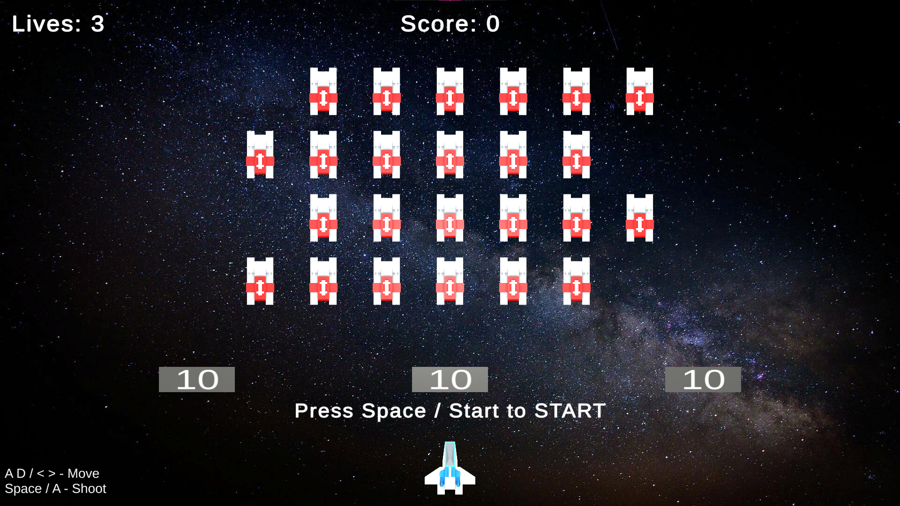

# Space Invaders

## Description
Small space invaders clone made in Unity

## Gameplay Features
- 3 difficulty levels
- 3 types of enemies
- Support for gamepads

## Technical Features
- State machine based game flow management
- Object pooling for enemies and projectiles
- Event driven UI
- Customizable enemies through scriptable objects

## Screenshots
### Menu

### Gameplay

### Easy

### Normal

### Hard

